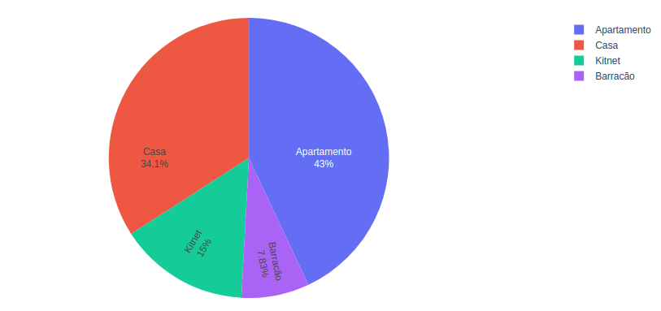
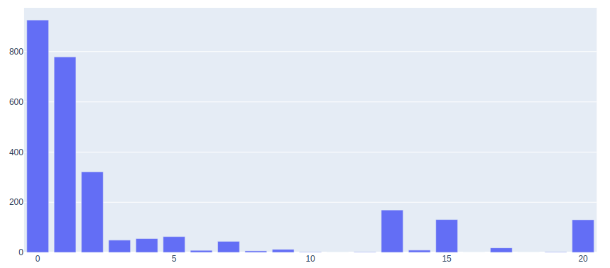

# Real estate price analysis
Scrapping and data analysis of properties in websites.


## Functionalities:

Crawler:
- Data collection per region
- Select sells or rents
- Schedule the time for scrapping run

Data analysis with jupyter notebook:
- Map with statistics per district
- Histogram of average price of sell/rent
- Histogram of advertisement time in platform 

Data visualization with kibana

(In progress)

## Installation:

First, install the Python libraries requirements executing:

```bash
pip3 install -r requirements.txt
```
To import and visualize the data with Kibana:

```bash
# Install filebeat
chmod +x install_filebeat.sh
./install_filebeat.sh
# Run containers with Kibana/Elasticsearch/Logstash
```

## Crawler execution:

You can select the region to scrapy.

In the folder imoveis_crawling execute:

```bash
scrapy crawl IMOVEIS -a category=venda -a region=grande-goiania-e-anapolis -a state=go
```

You can create a task that runs in background and download daily the ads: 

```bash
python3 tasks.py
```

Obs.: If you shut down the machine you need execute the crawler again. 

## Data analysis with Kibana:

(In progress)


## Data analysis with Jupyter Notebook:

We collect the data of Goiânia(BR) city between November' 19 and February' 20, The example of plots are showed bellow.  

Average of price of properties rent:


Type of properties:



Average time of advertisement in the website:


