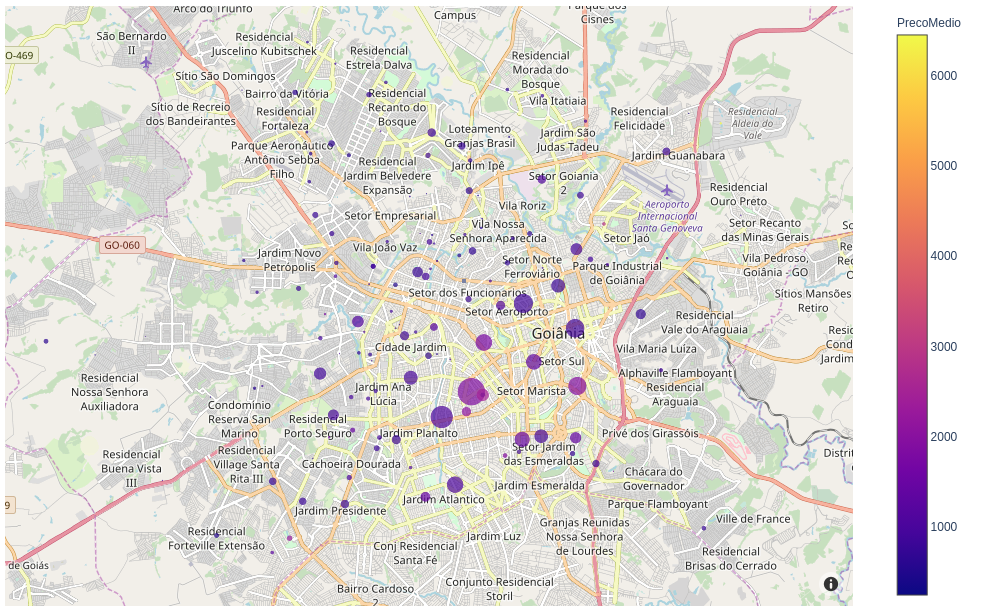
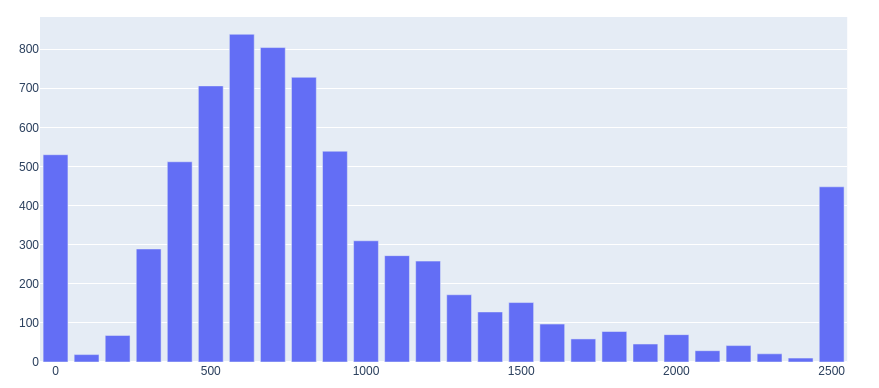

# Análise do preco de imoveis
Raspagem de anúncios em sites de imóveis e análise dos dados.



## Funcionalidades:

- Coleta de dados por região
- Opção de seleção de venda ou aluguel
- Rotina de verificação diária
- Gráfico com região
- Gráfico de preço médio de locação/venda
- Gráfico com tempo do anúncio na plataforma

## Instalação:

Para instalar os requisitos, execute:

```bash
pip3 install -r requirements.txt
```

## Execução do crawler:

O script do crawller baixa da Internet aúncios de aluguel ou venda de imoveis em determinada região.

Na pasta imoveis_crawling execute:

```bash
scrapy crawl IMOVEIS -a category=venda -a region=grande-goiania-e-anapolis -a state=go
```

Você também pode criar executar uma tarefa que roda em segundo plano e baixa diariamente os anúncios. Para isso execute o script **tasks.py**:

```bash
python3 tasks.py
```

Para isso, a máquina que estiver executando o script deve ficar ligada 24h. 

## Análise dos dados:


